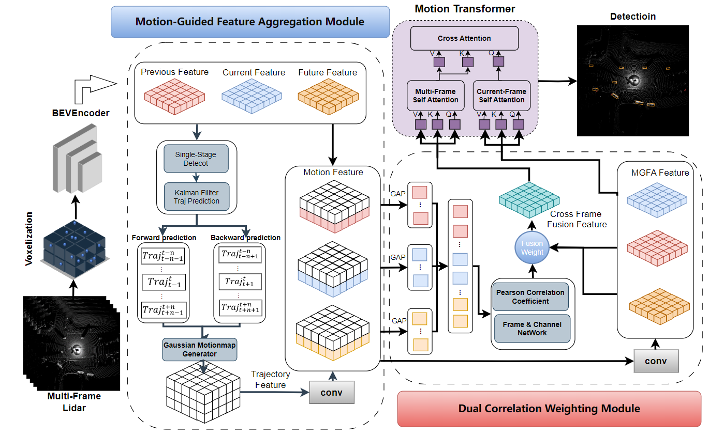

# LiSTM: Boosting  3D Object Detection with Temporal Motion Estimation in Point Cloud Sequences（BMVC2024）
A novel LiDAR 3D object detection with enhancing Spatial-Temporal feature fusion through Motion estimation
This project is built on [`Openpcdet`](https://github.com/open-mmlab/OpenPCDet).

## Abstract

Accurate and robust LiDAR-based 3D detection is essential for comprehensive scene understanding in autonomous driving and robotics. Despite its importance, 3D LiDAR detection performance is limited by inherent constraints of point cloud data, particularly under conditions of extended distances and occlusions. Recently, temporal aggregation has been proven to significantly enhance detection accuracy by fusing multi-frame viewpoint information and enriching the spatial representation of objects. In this work, we introduce a novel LiDAR 3D object detection framework, namely LiSTM, to facilitate spatial-temporal feature learning with cross-frame motion forecasting information. We aim to improve the spatial-temporal interpretation capabilities of the LiDAR detector by incorporating a dynamic prior, generated from a non-learnable motion estimation model. Specifically, Motion-Guided Feature Aggregation (MGFA) is proposed to utilize the object trajectory from previous and future motion states to model spatial-temporal correlations into Gaussian heatmaps over a driving sequence. This motion-based heatmap then guides the temporal feature fusion for enriching the proposed object features. Moreover, we design a Dual Correlation Weighting Module (DCWM) that effectively facilitates the interaction between past and prospective frames through scene- and channel-wise feature abstraction. In the end, a cascade cross-attention-based decoder is employed to refine the 3D prediction. We have conducted experiments on the Waymo and NuScenes datasets to demonstrate that proposed framework achieves superior 3D detection performance with effective spatial-temporal feature learning, compared to the baseline CenterPoint.

